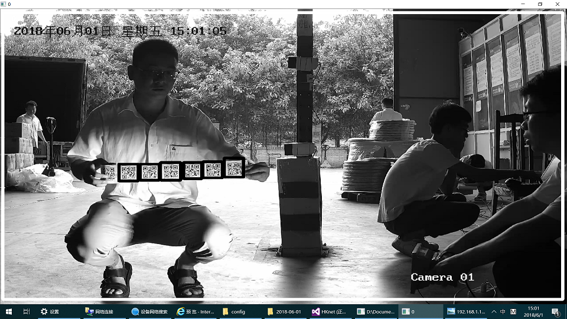
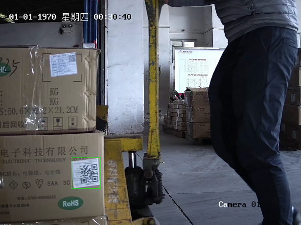

\***************程序功能******************************   
这是项目“适用于普通摄像机的物流二维码检测与识别技术”的核心算法，取消了海康威视摄像机的驱动模块、多摄像机并行模块等。只保留了核心算法：检测与解码二维码的模块。  
 
实现的功能是：检测电脑摄像头录像中出现的二维码，并解码出二维码内容。 

可选择使用两种检测算法：   
1、基于传统数字图像处理的检测算法   
2、基于级联分类器的机器学习方法   
算法2较之算法1消耗计算力更大，但性能更好。当使用高分辨率、长焦距的摄像机时，该算法可检测到更小的二维码。
 
  
 
  
 
 

\****************使用说明******************************    
系统要求：Windows（建议使用win10） 
1、双击run.bat即可开始运行  
2、用记事本编辑run.bat，去掉"-use_ml"标志即可使用传统算法，加上"-use_ml"即可使用机器学习算法  

检测并解码成功的二维码会在视频窗口中被框选出来，同时解码出的信息被打印在控制台中。  
在视频窗口上按ESC结束程序，之后在控制台输入回车退出程序。  

\*******************其他******************************  
1、传统方法检测二维码的处理流程：Sobel算子求x及y方向的梯度-->直方图均衡化-->二值化-->一系列膨胀腐蚀操作-->轮廓检测-->轮廓过滤  
2、级联分类器模型qrcode_cascade.xml使用约2000个正样本，3500个负样本训练得到。  
3、检测到的二维码使用第三方库Zbar进行解码  